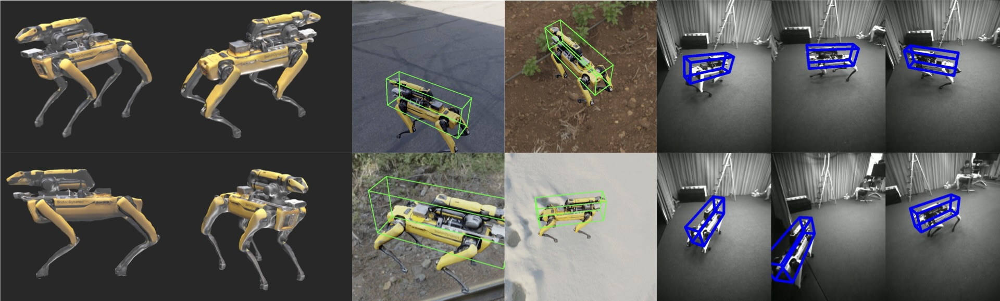

# 3DV Project - Monocular Pose Estimation for Human-Robot Co-Localization

## Project Description


 


This repository contains the code for the 3D vision project. Specifically it contains a pipeline to train a pose estimation algorithm of Boston Dynamics' Spot with OnePose++ as well as to create synthetic data for it, using BlenderProc2.

### Main Contributions
- **Accurate NeRF model of Spot** (see [Spot_NeRF](spot/nerf/nerf_spot.dae)) (created using [PolyCam](https://poly.cam))
- **Modular Synthetic data pipeline for any robot/object using BlenderProc**
- **First Dataset of Spot in BOP format to train Pose Estimation Algorithms for Spot** (~ 4000 frames)
  - The dataset can be downloaded [here](https://drive.google.com/drive/folders/1x7ZgAye9rGezCU0lczo5oUDe5kdprsVc?usp=sharing)
- **Conversion Scripts from BOP to slightly modified OnePose++ data**


## Installation
This project is quite modular and combines different pipelines/algorithms. Since these pipelines are very well documented, please follow the installation instructions of the respective projects.


### BlenderProc2
Blenderproc is required to create synthetic data. The installation instructions can be found [here](https://dlr-rm.github.io/BlenderProc/).
For this project, we additionally installed all HDRIs from polyhaven.com using `blenderproc download haven`.

### OnePose++
To install OnePose++, please follow the instructions from their ReadMe. We forked their repository and added some additional changes to make it compatible with our conversion scripts from BOP to their custom dateformat. The forked repository can be found [here](https://github.com/Maemaemaeko/OnePose_Plus_Plus_Spot) if the specific commits are of interest.


### Maplab
Maybe less important for this project, but still of interest for the robotics community, we tried used Maplab to generate the ground truth poses for the synthetic data. The installation instructions can be found [here](https://maplab.asl.ethz.ch/docs/master/index.html). Of course, this requires the user to have an environment with the different robots/agents/... . 


## Usage
To quickly create synthetic data, we created a bash script which can be found in the `scripts` folder. It can be run with the following command:
```bash
bash run.sh
```

First it runs the BlenderProc pipeline `blenderproc run src/synthetic_data_pipeline.py`. Next, the conversion scripts convert the BOP output data to our own 'custom' OnePose++ data. To have minimal changes in the OnePose++ code-base, and following the suggestions of the authors, we only changed a few lines in these two methods: `get_bbox3d()` and `data_process_anno()`, both in [parse_scanned_data.py](OnePose_Plus_Plus_Spot/parse_scanned_data.py)   

```
.
├── demo_cam-annotate
│   ├── 0.png
│   ├── ARposes.txt
│   ├── Box.txt
│   ├── Confidence
│   ├── Depth
│   ├── Frames.m4v
│   ├── Frames.txt
│   ├── Snapshot.png
│   └── intrinsics.txt
└── ...
```

The conversion scripts create the onepose_data directory, which can directly be used for training our modified OnePose++ algorithm. After further processing, it should be possible to convert the BOP data directly to the OnePose++ data format. However, the OnePose++ data requires a `Box.txt` file, which we could not create from the BOP data.

We derived the Box.txt parameters by visually inspecting the robot model in the world frame in Blender. We think, our data format is more accessible, albeit less robust, because it uses regular rotation matrices instead of quaternions.

```
.
├── bop_data
│   ├── camera.json
│   └── train_pbr
│       └── 000000
│           ├── depth
│           │   ├── 000000.png
...
│           │   └── 000099.png
│           ├── scene_camera.json
│           └── scene_gt.json
└── onepose_data
    ├── ARposes.txt
    ├── Box.txt
    ├── Frames.txt
    ├── intrinsics.txt
    └── synthetic_data_annotated.gif
```


### config.json
The config.json file contains all the parameters for the BlenderProc pipeline. It can be found in the root folder. The most important parameters are the following:

```json
{
    "DATA_DIR": "synthetic_data_new",   // where to store the data
    "SCENE": "00",                      // sub directory of DATA_DIR
    "DBG": 0,                           // whether to use the debugger in BlenderProc, enables for visual inspection of the scene
    "N_FRAMES": 100,                    // how many frames to render
    "RND_CAM": 1,                       // whether the camera should move randomly
    "MODEL": "nerf"                     // which model to use, NeRF or URDF from https://github.com/heuristicus/spot_ros
}
```
## Implementing OnePose++
Primarily, we adhered to the instructions provided by the authors of OnePose++ [here](https://github.com/Maemaemaeko/OnePose_Plus_Plus_Spot/blob/main/doc/demo.md). Ensure that you have already set up an environment for OnePose++ following their [ReadMe](https://github.com/Maemaemaeko/OnePose_Plus_Plus_Spot/blob/main/README.md)

### Step 1: Organize the data as the follow structure:
    ```
    |--- /path/to/OnePose_Plus_Plus_Spot/data/demo
    |       |--- Spot
    |       |       |---Spot-annotate # Synthetic data created using BlenderProc
                          |--- Frames.m4v
                          |--- ARposes.txt
                          |--- Box.txt
                          |--- Frames.txt
                          |--- intrinsics.txt
                          |--- (synthetic_data_annotated.gif)
    |       |       |---Spot-test # Real World data captured from Hololens
                          |--- Frames.m4v
                          |--- Frames.txt
    ```
    
### Step 2: Run OnePose with collected data
Execute the following commands, and a demo video naming `demo_video.mp4` will be saved in the folder of the test sequence.
```shell
conda activate oneposeplus 
bash /path/to/OnePose_Plus_Plus_Spot/scripts/demo_pipeline.sh Spot
```

## Projecting Real World data to Hololens Camera frame
The world_to_camera_projection.ipynb contains the code with which we attempted to project the Spot position into the HoloLens camera frame. To run it requires a .bag recording of the Hololens and Spot robots, as well as a vertex_poses_velocities_biases.csv containing the positions and orientations of HoloLens and Spot in world coordinate frame, generated with MapLab


## TODO

- [ ] create more robust synthetic training data
- [ ] create a better robot model after the NeRF model, which can be controlled
- [ ] add different lighting conditions to the synthetic data
- [ ] add occlusions to the synthetic data
- [ ] change conversion scripts, to use OnePose directly
